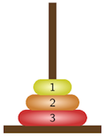
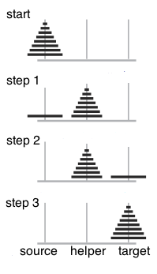

**CMSI 1010** Computer Programming & Laboratory, Fall 2022

# Problem Set 5
**Due 11:59pm PT 10/27**

## Reading
All readings are from the [_Think Python_ textbook](http://greenteapress.com/thinkpython2/thinkpython2.pdf):
* Chapter 4
* Sections 5.8–5.10 and 6.5–6.9

Optionally, take notes from these readings and submit them as part of this pset. If you opt to do this, you may submit them as a separate file `ps5_notes.txt`/`ps5_notes.md` or you may add them directly to this README file. (files that end in `.md` look best when written in [GitHub Markdown](https://guides.github.com/features/mastering-markdown/))

## Programming

0. **Recursive Exponential**—`exponential.py`

    Write a recursive function `exponential(base, exp)` that calculates `base ** exp` without using the `**` operator, just as we did in **ps3**, but this time with recursion instead of an iterative `for` loop. This time, allow positive exponents only—`raise` a `ValueError` if `exp` is negative. (we haven’t seen `raise` in a while—if you need a review, look it up in the book)

1. **Turtle Flower**—`flower.ipynb`

    Remember our flower shop from Lab 09? Well, business is booming and you want to create a logo for it…_and_ you want to give it a recursive look! Unlike the other programs, this one is to be submitted via a Jupyter notebook, `flower.ipynb`. As with the labs, run this in Google Colaboratory first, then save a copy to GitHub but in _this ps5 repository_ rather than your lab notebooks repository. Details can be found in the notebook.

2. **(Optional, uses `class`) Towers of Hanoi**—`towers.py`

    _Towers of Hanoi_ is a mathematical game or puzzle. If you’ve never played it before, you can try it out at https://www.mathsisfun.com/games/towerofhanoi.html!

    As you can see, the game consists of three rods, and a number of disks of different sizes. The puzzle starts with the disks in a neat stack from biggest to smallest on one rod. The objective of the puzzle is to move the entire stack to another rod, while obeying the following rules:

    * Only one disk may be moved at a time.
    * Each move consists of taking the top disk from one of the rods and sliding it onto another rod, on top of the other disks that may already be present on that rod.
    * You can never have a larger disk on top of a smaller disk.

    In this exercise, your goal is to write a **recursive** program to solve this game.

    Open `towers.py` and you will see the start of a simple class `Rod`. `Rod` has a `name` attribute, as well as an `elements` attribute, which remembers which disks are on the rod in what order. Specifically, `elements` is a list of numbers, with the elements ordered from bottom to top, and larger numbers representing larger disks.

    For example, a `Rod` with the list `[3, 2, 1]` as its `elements` attribute would represent the following:

    

    We have also initalized our three (3) `Rod`s with four (4) disks as follows:
    
    ```python
    num_disks = 4
    disks = list(range(num_disks, 0, -1))
    rod_left = Rod('ROD_LEFT', disks)  ## left rod (named ROD_LEFT) has 4 disks [4,3,2,1]
    rod_middle = Rod('ROD_MIDDLE', []) ## middle rod is named ROD_MIDDLE & has no disks []
    rod_right = Rod('ROD_RIGHT', [])   ## right rod is named ROD_RIGHT & has no disks []
    hanoi(num_disks, rod_left, rod_middle, rod_right)
    ```

    Our goal in this problem is to write a program that will win Towers of Hanoi for us! 

    1. First, you need to finish writing the `Rod` class, specifically the methods `take_off_top_disk()` and `add_disk(num)`. `take_off_top_disk()` should take off and return the top disk on the rod. `add_disk(num)` should add the disk `num` if it is legal—if someone tries to add a larger disk on top of a smaller disk, `add_disk` should `raise` an `Exception`. (This can be done with the Python statement `raise Exception()`, which displays an error and stops the program, as you have seen many times when your programs had problems!)
    2. Now, fill in the function `move_one_disk(current_rod, new_rod)`, which takes two `Rod` objects, and moves the top disk from `current_rod` to `new_rod`.
    3. Finally, let’s fill in the function `hanoi(num, source_rod, helper_rod, target_rod)`, which should move `num` disks from `source_rod` to the `target_rod` (with the help of `helper_rod`) to win the game! A key to solving this puzzle is to recognize that it can be solved by breaking the problem down into smaller problems and further breaking those problems down into even smaller problems until a solution is reached. 

        Specifically, let’s describe our game strategy below. Remember that when we start the game, the disks are stacked in order from `n` (largest) to `1` (smallest) on `source_rod`. We can move the `n` disks from `source_rod` to `target_rod` with the following steps:

        1. Move `n - 1` disks from `source_rod` to `helper_rod`. (This leaves disk `n` alone on `source_rod`.)

            _Hint:_ Do you have a function that will do this for you?
        2. Move disk `n` from `source_rod` to `target_rod`. We will also print the rods at this step so we can visualize the game.
        3. Move `n - 1` disks from `helper_rod` to `target_rod` so they sit on disk `n`.

        Our strategy can be visualized below:

        

        Let’s make sure we understand how and why this strategy works.
        
        * First, walk through the strategy with `n == 2`. That is, you want to move two (2) disks from source to target. Does it work? What disks do you move where to make this happen?
        * If it works, then you can assume you can “magically” move two disks from any rod to any other rod. If you can “magically” move two disks from any rod to any other rod, how can you move three (3) disks from source to target? (Does our strategy help?)
        * If you can “magically” move three disks from anywhere to anywhere, how can you move four (4) disks from source to target? 
        * Can you generalize this to prove why this strategy works for any _n_? (You have just used induction, which you may learn about in greater detail in a Proofs/Discrete Math class someday!)

        With this strategy, let’s fill in the `hanoi(num, source_rod, helper_rod, target_rod)` function now based on the general strategy described above. When it is complete, running `towers.py` should show you step-by-step how to win Towers of Hanoi with four (4) disks!

        _Hint:_ Don’t forget to take care of the base case `n == 0`, or no disks.

## What to turn in
1. Submit the electronic copy of any files that you created/modified on your clone. In the Terminal (within your repository clone folder), type these commands. Note that you may repeat these add-commit-push sequences as frequently as you like, based on your progress:
    ```bash
    git add README.md     # If you edited the README.md file on your clone.
    git add ps5_notes.md  # If submitting reading notes as a separate file.
    git add exponential.py
    git add towers.py     # If you did the optional program.
    git commit -m "adding files for ps5" # Ideally, personalize this!
    git push
    ```
2. Copy your flower-logo-capable `flower.ipynb` notebook from Google Colaboratory to this repository. Yes, you will be overwriting the original version.

3. Edit this _README.md_ file to include your answers to the following questions:
    * **Number of hours spent** working on this pset: 2 hours
    * (Optional) Feel free to let us know what you liked/disliked about this pset, what you learned, etc:

## Points breakdown
| Category | Points |
| -------- | -----: |
| Notes  | 3 points extra credit |
| `exponential.py` | 50 points |
| `flower.ipynb` | 50 points |
| `towers.py` | 20 points extra credit |
| **Total** | 100 points |
